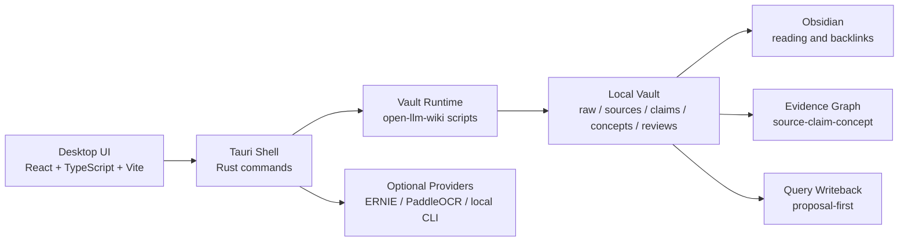

# LLM Wiki Desktop

<div align="center">

[](LICENSE)
[](src-tauri/tauri.conf.json)
[](package.json)
[](package.json)
[](src-tauri/Cargo.toml)
[](#safety-boundaries)

[中文](README.md) | [Product Plan](docs/PRD.md) | [Scoring Map](docs/scoring-mapping.md) | [Release Readiness](docs/release-readiness.md) | [Roadmap](ROADMAP.md)

**A local-first desktop app that turns papers, Markdown files, and research corpora into an auditable, source-traceable, writeback-ready LLM Wiki.**


</div>

---

## Feature Overview

| Module | Capability | Why it matters |
| --- | --- | --- |
| **Vault Management** | Create or open an `open-llm-wiki` vault, then check runtime, schema, and Obsidian status | Users can tell whether the project is actually runnable before ingesting anything |
| **Raw Sources** | Import PDFs, Markdown, txt, and zip packages while preserving folder context, hashes, parsers, and artifacts | Every evidence item remains traceable, with duplicate and blocked states made visible |
| **Ingest Pipeline** | Run parse, source discovery, claims, normalization, QA, contradictions, review, concept revision, and lint in sequence | Research corpora become stable sources, claims, concepts, and review queues |
| **Evidence Graph** | Show relationships among sources, claims, concepts, reviews, proposals, and warnings | Users can trace conclusions back to evidence and find broken links or writeback candidates |
| **Chat / Writeback** | Ask vault-grounded questions and generate proposal-first writeback artifacts | Model output does not silently mutate the wiki; users review diffs and evidence first |
| **Review Queue** | Surface science review, needs-review claims, stale claims, contradictions, and traceability warnings | Human and scientific review boundaries remain explicit |
| **Obsidian Handoff** | Open the generated vault or entry note from the desktop app | Reading, backlinks, and manual knowledge work stay in a familiar Obsidian workflow |
| **Agent Read API** | Expose a localhost, token-protected read API only after a readiness gate passes | Codex / Claude Code can read evidence without receiving delete, apply, or background ingest powers |

---

## Interface Preview

The screenshots below come from local DeepSeek paper-corpus validation. Menu bars, Dock, and absolute local paths were cropped out.

<table>
  <tr>
    <td align="center" width="50%">
      
      <br>
      <b>Raw Sources</b>
      <br>
      Manage imported files, parser artifacts, source registry, and traceability state.
    </td>
    <td align="center" width="50%">
      
      <br>
      <b>Chat / Writeback</b>
      <br>
      Search vault evidence, draft grounded answers, and create reviewable writeback proposals.
    </td>
  </tr>
  <tr>
    <td align="center" width="50%">
      
      <br>
      <b>Evidence Graph</b>
      <br>
      Inspect source -> claim -> concept / review / proposal / warning relationships.
    </td>
    <td align="center" width="50%">
      
      <br>
      <b>Provider Settings</b>
      <br>
      Configure ERNIE, PaddleOCR, local CLIs, and provider boundaries without storing plaintext keys.
    </td>
  </tr>
</table>

---

## Quick Start

### Launch the Desktop App

```bash
cd /path/to/llm-wiki-desktop
npm ci
npm run desktop:dev
```

If a local app bundle has already been built, you can open it directly on macOS:

```bash
open "src-tauri/target/release/bundle/macos/LLM Wiki.app"
```

### First Run

1. Choose `New Project` or `Open Project` from the Welcome page.
2. If the vault does not yet contain a runtime, select the local `open-llm-wiki` repository path in Settings.
3. Import PDFs, Markdown files, txt files, or zip corpora from `Raw Sources`.
4. Review the ingest plan and action panel before running the pipeline.
5. Inspect the generated wiki from `Graph`, `Review`, `Chat / Writeback`, and Obsidian.

Do not open the raw PDF folder as a project. Obsidian should open the generated LLM Wiki vault.

---

## Typical Workflow

```text
PDF / Markdown / ZIP
        |
        v
LLM Wiki Desktop
        |
        v
open-llm-wiki Runtime
        |
        +--> raw evidence / parser artifacts
        +--> source pages / claims / QA reports
        +--> science review queue / contradictions
        +--> concept pages / query writeback proposals
        |
        v
Obsidian + Evidence Graph + Review UI
```

| Stage | Desktop entry point | Result |
| --- | --- | --- |
| Create a wiki | Welcome / Dashboard | Initialize a vault and check runtime, schema, and Obsidian readiness |
| Import material | Raw Sources | Files enter `raw/inbox/` with plan state, hashes, and artifact contracts |
| Run the pipeline | Dashboard / Raw Sources | Execute parse -> ingest -> claims -> QA -> review -> concept revision |
| Browse evidence | Sources / Concepts / Graph | Inspect evidence anchors, claims, concepts, and broken-link warnings |
| Ask and write back | Chat / Writeback | Create evidence-mapped answer drafts and proposal artifacts |
| Review manually | Review / Obsidian | Apply writeback only after explicit approval |

---

## Architecture



| Layer | Technology |
| --- | --- |
| Frontend | React 18, TypeScript 5, Vite 6, lucide-react, react-markdown, Mermaid, KaTeX |
| Desktop shell | Tauri 2, Rust 2021, `tauri-plugin-dialog`, `tauri-plugin-opener` |
| Graph | Sigma, Graphology, ForceAtlas2 |
| Runtime | `open-llm-wiki` Python scripts and vault schema |
| Local data | Generated vault files, `_state/*.jsonl`, `log-archive/desktop/` |
| Optional providers | ERNIE, PaddleOCR-VL Document Parsing Skill, local Codex / Claude CLI |

---

## Safety Boundaries

- Local-first by default. Raw documents are not uploaded without explicit configuration and user action.
- API keys are passed through environment variables or secure paths, not stored or displayed as plaintext in the UI.
- The desktop app does not move drafts into `sources/`, edit QA verdicts, or rewrite historical QA reports directly.
- Query writeback creates `reviews/query-writeback/` proposals by default and does not silently modify `concepts/` or `sources/`.
- Science review, human review, and writeback approval are not fabricated by the desktop shell.
- The Agent API must pass a read-only readiness gate and does not expose apply, delete, parser, ingest, cloud OCR, or external-search endpoints.
- Source, claim, QA, contradiction, and concept writes remain owned by the `open-llm-wiki` runtime boundary.

---

## API and Provider Setup

<details>
<summary><b>Expand common configuration</b></summary>

| Setting | Purpose | Default behavior |
| --- | --- | --- |
| `AI_STUDIO_API_KEY` | ERNIE connectivity and evidence-first answer drafts | Missing keys show as not configured and do not upload raw documents |
| `PADDLEOCR_API_KEY` | Default key source for the PaddleOCR-VL Document Parsing Skill | Missing keys block the ingest plan and do not run OCR |
| OCR Parser endpoint | PaddleOCR-VL service URL | Must be configured explicitly; non-localhost HTTP endpoints are rejected |
| Local CLI paths | Codex / Claude local CLI diagnostics | Used only for local checks, not automatic writes |

More detail:

- [ERNIE Provider Setup](docs/ernie-provider-setup.md)
- [PaddleOCR-VL Provider Setup](docs/paddleocr-vl15-setup.md)
- [Provider Adapter Contract](docs/provider-adapter-contract.md)

</details>

---

## Developer Mode

<details>
<summary><b>Expand development, test, and packaging commands</b></summary>

### Install and Run

```bash
npm ci
npm run desktop:dev
```

### Common Commands

| Command | Purpose |
| --- | --- |
| `npm run start` | Start the full Tauri desktop app |
| `npm run desktop:dev` | Start the Tauri dev shell, which launches Vite internally |
| `npm run dev:web` | Start only the Vite web view for UI debugging |
| `npm test` | Run the combined TypeScript, Rust, and smoke test path |
| `npm run build` | Typecheck and build the frontend into `dist/` |
| `npm run build:app` | Build the local Tauri app bundle |
| `npm run smoke:macos:bundle` | Open the packaged macOS `.app` and verify that it starts with at least one visible window |
| `cargo test --manifest-path src-tauri/Cargo.toml` | Run Rust tests directly |

### Local Release Candidate

```bash
npm ci
npm run build
npm test
npm run build:app
npm run smoke:macos:bundle
```

Local `.app` / `.dmg` artifacts prove only that the current Mac can build and launch the app. They do not prove signing, notarization, or public distribution readiness. See [Release Readiness](docs/release-readiness.md).

</details>

---

## Chinese ZIP / Mixed Corpus Smoke

<details>
<summary><b>Expand ZIP import contract check</b></summary>

`deepseek_paper_中文.zip` validates Chinese filenames and mixed corpus import behavior. The smoke path must treat the original ZIP as read-only: do not modify it, commit extracted contents, move or rename the original file, or commit screenshots with private paper content or local paths.

```bash
mkdir -p artifacts/smoke/zip
node scripts/smoke/zip-import-contract.mjs \
  "../deepseek_paper_中文.zip" \
  --out "artifacts/smoke/zip/deepseek_paper_中文-report.json"
```

The report should record each ZIP entry's `source_path`, `target_path`, `sha256`, `ignored` state, and `ignored_reason`. `__MACOSX/`, `.DS_Store`, `._*`, `../` traversal, absolute paths, and symlink escape risks must be ignored or rejected and must not write outside the vault.

</details>

---

## Repository Layout

```text
llm-wiki-desktop/
|-- src/                    # React desktop UI
|-- src-tauri/              # Tauri 2 shell and Rust commands
|-- docs/                   # Product, provider, release and smoke docs
|-- docs/screenshots/       # README and PR evidence screenshots
|-- examples/demo-vault/    # Synthetic demo vault, no private papers
|-- scripts/                # Local smoke, benchmark and build helpers
|-- benchmarks/             # Submission and OCR/QA benchmark assets
|-- package.json
`-- README.md
```

---

## More Documentation

| Document | Best for |
| --- | --- |
| [Product Requirements](docs/PRD.md) | Product scope, user stories, and acceptance criteria |
| [Scoring Mapping](docs/scoring-mapping.md) | Competition / review scoring mapped to product surfaces |
| [Product Parity Matrix](docs/product-parity-matrix.md) | Comparison with reference wiki and Obsidian workflows |
| [Agent Read API](docs/agent-skill.md) | Codex / Claude Code read-only API readiness gate |
| [Runtime Dependency Strategy](docs/runtime-dependency-strategy.md) | Runtime, vault, and desktop dependency boundaries |
| [macOS Clean Profile Smoke](docs/smoke-test-macos-clean-profile.md) | Manual acceptance on a clean macOS profile |
| [Windows Dev Smoke](docs/smoke-test-windows-dev.md) | Windows development smoke checks |
| [License](LICENSE) | Apache-2.0 license |
| [Contributing](CONTRIBUTING.md) | Contributor guide |
| [Security](SECURITY.md) | Vulnerability reporting |
| [Code of Conduct](CODE_OF_CONDUCT.md) | Community conduct expectations |
| [Changelog](CHANGELOG.md) | Release history |
| [Roadmap](ROADMAP.md) | Future direction |

---

## FAQ

<details>
<summary><b>Can I use it without API keys?</b></summary>

Yes. You can open the app, create vaults, browse local materials, inspect the graph, and run local paths that do not depend on providers. ERNIE, PaddleOCR, or hosted parser features require explicit environment variables and endpoints.

</details>

<details>
<summary><b>Does it upload data to the cloud automatically?</b></summary>

No. Raw documents are not uploaded by default. PaddleOCR, hosted parsers, and external LLM providers require explicit configuration and explicit user actions; missing configuration is shown as blocked or not configured.

</details>

<details>
<summary><b>Does it replace Obsidian?</b></summary>

No. The desktop app handles ingest, evidence tracing, review, writeback proposals, and runtime orchestration. Obsidian remains the companion layer for reading, backlinks, graph exploration, and manual organization.

</details>

<details>
<summary><b>Why not directly edit concepts or sources?</b></summary>

Because `sources/`, `claims/`, and `concepts/` are part of the auditable knowledge base. The desktop app writes through review queues and query writeback proposals by default so model output cannot bypass evidence, QA, and human approval.

</details>
