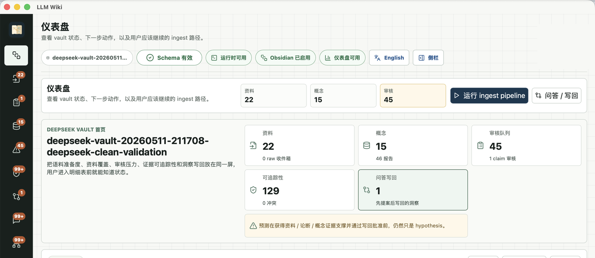
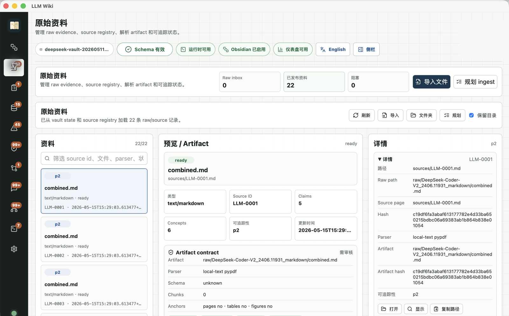
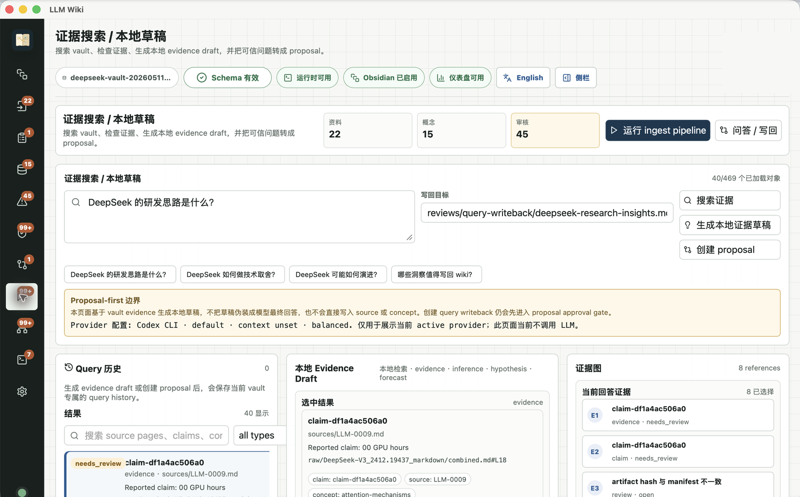
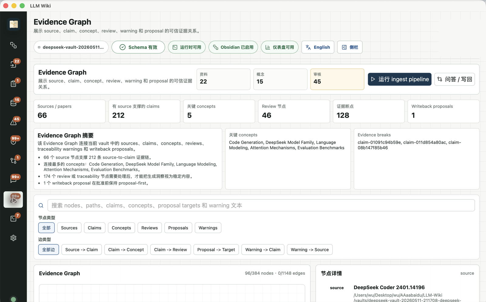
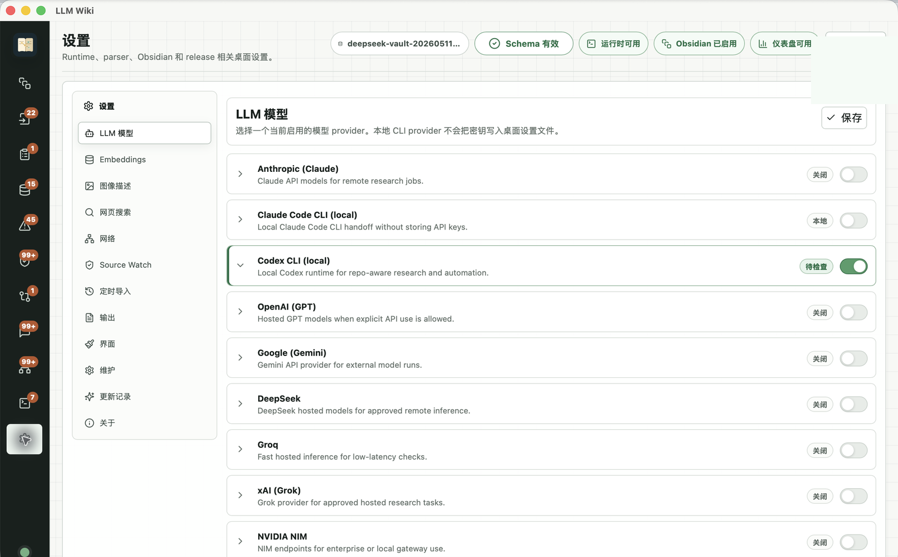
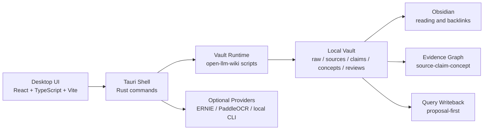

# LLM Wiki Desktop

<div align="center">

[](LICENSE)
[](src-tauri/tauri.conf.json)
[](package.json)
[](package.json)
[](src-tauri/Cargo.toml)
[](#安全边界)

[English](README.en.md) | [产品规划](docs/PRD.md) | [评分映射](docs/scoring-mapping.md) | [发布检查](docs/release-readiness.md) | [Roadmap](ROADMAP.md)

**本地优先的论文知识库桌面端，把 PDF、Markdown 和论文包转成可追踪、可审核、可写回的 LLM Wiki。**



</div>

---

## 功能概览

| 模块 | 能力 | 用户价值 |
| --- | --- | --- |
| **Vault 管理** | 新建 / 打开 `open-llm-wiki` vault，检测 runtime、schema、Obsidian 状态 | 避免把原始 PDF 文件夹误当知识库，第一步就知道项目是否可运行 |
| **Raw Sources** | 导入 PDF、Markdown、txt、zip，保留目录上下文，记录 hash、parser、artifact | 每份 evidence 都可追踪，重复文件和阻塞状态清楚可见 |
| **Ingest Pipeline** | 串行执行 parse、source discovery、claims、normalize、QA、contradictions、review、concept revision、lint | 把论文语料转成稳定 source、claim、concept 和 review queue |
| **Evidence Graph** | 展示 source、claim、concept、review、proposal、warning 的关系 | 从结论反查证据，也能发现断链、桥接节点和可写回 insight |
| **Chat / Writeback** | 基于 vault evidence 提问，生成 answer draft 和 proposal-first writeback | 不把模型回答静默写入知识库，先审查 diff 和证据链接 |
| **Review Queue** | 显示 science review、needs_review、stale、contradicted、traceability warning | 保留人工审查边界，不伪造批准 |
| **Obsidian Handoff** | 从桌面端打开生成后的 vault 或 entry note | 阅读、反链、图谱和人工整理交给熟悉的 Obsidian 工作流 |
| **Agent Read API** | 通过 readiness gate 后开放 `127.0.0.1` 只读、token-protected API | 给 Codex / Claude Code 读 evidence，不开放删除、apply 或后台 ingest |

---

## 界面预览

截图来自本地 DeepSeek 论文语料验收流程，已裁掉菜单栏、Dock 和本机绝对路径，只保留软件窗口本身。

<table>
  <tr>
    <td align="center" width="50%">
      
      <br>
      <b>Raw Sources</b>
      <br>
      管理导入文件、parser artifact、source registry 和 traceability 状态。
    </td>
    <td align="center" width="50%">
      
      <br>
      <b>Chat / Writeback</b>
      <br>
      基于 vault evidence 检索、回答，并生成可审核写回提案。
    </td>
  </tr>
  <tr>
    <td align="center" width="50%">
      
      <br>
      <b>Evidence Graph</b>
      <br>
      查看 source -> claim -> concept / review / proposal / warning 关系。
    </td>
    <td align="center" width="50%">
      
      <br>
      <b>Provider Settings</b>
      <br>
      配置 ERNIE、PaddleOCR、本地 CLI 和 provider 边界，不保存明文 key。
    </td>
  </tr>
</table>

---

## 快速开始

### 启动桌面端

```bash
cd /path/to/llm-wiki-desktop
npm ci
npm run desktop:dev
```

已经完成本地打包时，也可以直接打开 macOS app：

```bash
open "src-tauri/target/release/bundle/macos/LLM Wiki.app"
```

### 第一次使用

1. 在 Welcome 页选择 `新建项目` 或 `打开项目`。
2. 如果 vault 内还没有 runtime，在 Settings 中选择本地 `open-llm-wiki` 仓库路径。
3. 在 `Raw Sources` 导入 PDF、Markdown、txt 或 zip 论文包。
4. 先查看 ingest plan 和 action panel，再运行 ingest pipeline。
5. 在 `Graph`、`Review`、`Chat / Writeback` 和 Obsidian 中检查生成结果。

不要直接打开原始 PDF 文件夹。Obsidian 应该打开生成后的 LLM Wiki vault。

---

## 典型工作流

```text
PDF / Markdown / ZIP
        |
        v
LLM Wiki Desktop
        |
        v
open-llm-wiki Runtime
        |
        +--> raw evidence / parser artifacts
        +--> source pages / claims / QA reports
        +--> science review queue / contradictions
        +--> concept pages / query writeback proposals
        |
        v
Obsidian + Evidence Graph + Review UI
```

| 阶段 | 桌面端入口 | 结果 |
| --- | --- | --- |
| 创建知识库 | Welcome / Dashboard | 初始化 vault，检测 runtime、schema、Obsidian |
| 导入资料 | Raw Sources | 文件进入 `raw/inbox/`，生成 plan、hash 和 artifact contract |
| 运行流程 | Dashboard / Raw Sources | 执行 parse -> ingest -> claims -> QA -> review -> concept revision |
| 浏览证据 | Sources / Concepts / Graph | 查看 evidence anchor、claim、concept 和断链 warning |
| 提问写回 | Chat / Writeback | 生成带 evidence map 的 answer draft 和 proposal artifact |
| 人工审查 | Review / Obsidian | 只在明确批准后 apply writeback |

---

## 技术架构



| 层级 | 技术 |
| --- | --- |
| 前端 | React 18、TypeScript 5、Vite 6、lucide-react、react-markdown、Mermaid、KaTeX |
| 桌面壳 | Tauri 2、Rust 2021、`tauri-plugin-dialog`、`tauri-plugin-opener` |
| 图谱 | Sigma、Graphology、ForceAtlas2 |
| Runtime | `open-llm-wiki` Python scripts and vault schema |
| 本地数据 | Generated vault files, `_state/*.jsonl`, `log-archive/desktop/` |
| 可选 provider | ERNIE、PaddleOCR-VL 文档解析技能、本地 Codex / Claude CLI |

---

## 安全边界

- 默认本地优先。没有显式配置和用户动作时，不上传 raw documents。
- API key 通过环境变量或安全路径传入，不在 UI 明文保存或展示。
- 桌面端不直接把 draft 移到 `sources/`，不修改 QA verdict，不重写历史 QA report。
- Query writeback 默认生成 `reviews/query-writeback/` proposal，不静默写入 `concepts/` 或 `sources/`。
- Science review、human review 和 writeback approval 不会被桌面端伪造。
- Agent API 必须先通过只读 readiness gate；不提供 apply、delete、parser、ingest、cloud OCR 或外部搜索端点。
- 所有 source、claim、QA、contradiction、concept 写入都走 `open-llm-wiki` runtime 边界。

---

## API 与 Provider 配置

<details>
<summary><b>展开常用配置</b></summary>

| 配置项 | 用途 | 默认行为 |
| --- | --- | --- |
| `AI_STUDIO_API_KEY` | ERNIE / 文心一言连接测试和 evidence-first answer draft | 缺失时显示未配置，不上传 raw documents |
| `PADDLEOCR_API_KEY` | PaddleOCR-VL 文档解析技能的默认 key 来源 | 缺失时 ingest plan 阻塞，不运行 OCR |
| OCR Parser endpoint | PaddleOCR-VL service URL | 必须显式配置；非 localhost HTTP 会被拒绝 |
| Local CLI paths | Codex / Claude 本地 CLI 检测 | 只做本地诊断，不自动执行写入动作 |

详细说明：

- [ERNIE / 文心一言 Provider Setup](docs/ernie-provider-setup.md)
- [PaddleOCR-VL Provider Setup](docs/paddleocr-vl15-setup.md)
- [Provider Adapter Contract](docs/provider-adapter-contract.md)

</details>

---

## 开发者模式

<details>
<summary><b>展开开发、测试和打包命令</b></summary>

### 安装和启动

```bash
npm ci
npm run desktop:dev
```

### 常用命令

| Command | Purpose |
| --- | --- |
| `npm run start` | 启动完整 Tauri 桌面端 |
| `npm run desktop:dev` | 启动 Tauri dev shell，内部拉起 Vite |
| `npm run dev:web` | 只启动 Vite Web 视图，用于 UI 调试 |
| `npm test` | 运行 TypeScript/Rust/smoke 测试组合 |
| `npm run build` | 运行 typecheck 并生成前端 `dist/` |
| `npm run build:app` | 运行 Tauri 本地应用打包 |
| `npm run smoke:macos:bundle` | 打开打包后的 macOS `.app`，并确认进程启动后至少创建一个可见窗口 |
| `cargo test --manifest-path src-tauri/Cargo.toml` | 单独运行 Rust tests |

### 本地 release candidate

```bash
npm ci
npm run build
npm test
npm run build:app
npm run smoke:macos:bundle
```

本地 `.app` / `.dmg` 只能证明当前机器可构建和启动，不等同于签名、notarization 或公开分发。完整检查见 [Release Readiness](docs/release-readiness.md)。

</details>

---

## 中文 ZIP / 混合资料包 Smoke

<details>
<summary><b>展开 ZIP import 合同检查</b></summary>

`deepseek_paper_中文.zip` 用于验证中文文件名和混合资料包导入体验。smoke 必须只读原始 ZIP：不要修改 ZIP、不要提交解压内容、不要移动或重命名原始文件，也不要把真实论文截图或私有路径提交进 Git。

```bash
mkdir -p artifacts/smoke/zip
node scripts/smoke/zip-import-contract.mjs \
  "../deepseek_paper_中文.zip" \
  --out "artifacts/smoke/zip/deepseek_paper_中文-report.json"
```

报告应记录每个 ZIP 条目的 `source_path`、`target_path`、`sha256`、是否 `ignored`、以及 `ignored_reason`。`__MACOSX/`、`.DS_Store`、`._*`、`../` traversal、绝对路径和 symlink escape 风险必须被忽略或拒绝，不能写入 vault 外部。

</details>

---

## 项目结构

```text
llm-wiki-desktop/
|-- src/                    # React desktop UI
|-- src-tauri/              # Tauri 2 shell and Rust commands
|-- docs/                   # Product, provider, release and smoke docs
|-- docs/screenshots/       # README and PR evidence screenshots
|-- examples/demo-vault/    # Synthetic demo vault, no private papers
|-- scripts/                # Local smoke, benchmark and build helpers
|-- benchmarks/             # Submission and OCR/QA benchmark assets
|-- package.json
`-- README.md
```

---

## 更多文档

| 文档 | 适合谁 |
| --- | --- |
| [Product Requirements](docs/PRD.md) | 产品范围、用户故事和验收标准 |
| [Scoring Mapping](docs/scoring-mapping.md) | 比赛/评审评分点与功能映射 |
| [Product Parity Matrix](docs/product-parity-matrix.md) | 与参考 wiki / Obsidian 工作流的能力对照 |
| [Agent Read API](docs/agent-skill.md) | Codex / Claude Code 只读 API readiness gate |
| [Runtime Dependency Strategy](docs/runtime-dependency-strategy.md) | runtime、vault 和桌面端依赖边界 |
| [macOS Clean Profile Smoke](docs/smoke-test-macos-clean-profile.md) | macOS 干净环境手动验收 |
| [Windows Dev Smoke](docs/smoke-test-windows-dev.md) | Windows 开发环境 smoke 检查 |
| [License](LICENSE) | Apache-2.0 license |
| [Contributing](CONTRIBUTING.md) | 协作者指南 |
| [Security](SECURITY.md) | 安全漏洞报告 |
| [Code of Conduct](CODE_OF_CONDUCT.md) | 社区行为准则 |
| [Changelog](CHANGELOG.md) | 版本变化记录 |
| [Roadmap](ROADMAP.md) | 后续路线图 |

---

## 常见问题

<details>
<summary><b>不配置 API key 能用吗？</b></summary>

可以打开、创建 vault、浏览本地资料、查看 graph、运行不依赖 provider 的本地流程。需要 ERNIE、PaddleOCR 或 hosted parser 时，必须显式配置对应环境变量和 endpoint。

</details>

<details>
<summary><b>数据会自动上传到云端吗？</b></summary>

不会。默认不会上传 raw documents。PaddleOCR / hosted parser / 外部 LLM 都需要用户配置和显式运行；缺少配置时会显示 blocked 或 not configured。

</details>

<details>
<summary><b>它会替代 Obsidian 吗？</b></summary>

不会。桌面端负责 ingest、证据追踪、review、writeback proposal 和 runtime 编排；Obsidian 仍是阅读、反链、图谱和人工整理的 companion layer。

</details>

<details>
<summary><b>为什么不能直接编辑 concept 或 source？</b></summary>

因为 `sources/`、`claims/`、`concepts/` 是可审核知识库的一部分。桌面端默认通过 review queue 和 query writeback proposal 写入，避免模型输出绕过 evidence、QA 和人工批准。

</details>
